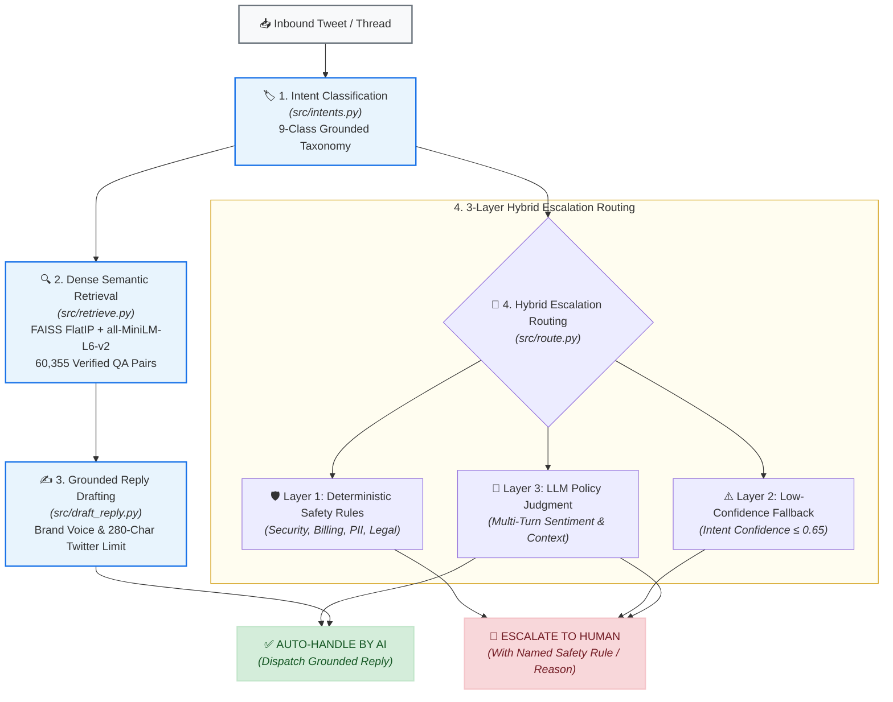

# 📦 AI Customer Support Agent for AmazonHelp

An end-to-end, production-oriented AI customer support agent for **AmazonHelp** built on real-world multi-turn Twitter dialogue data from Kaggle's *Customer Support on Twitter* (`twcs.csv`, ~2.8M tweets).

The agent performs **inbound intent classification**, **FAISS dense semantic grounding**, **brand-voice constrained response drafting**, and **3-layer hybrid escalation routing** with safety auditability.

---

## 📑 Core Documentation & Deliverables

* 📊 **[Comprehensive Evaluation Report](report/REPORT.md)**: Full baseline comparisons, per-intent metrics, 4-tier routing ablation, human-judge agreement, failure mode analysis with real thread IDs, and headline metric limitations.
* 📝 **[Engineering Decision Log](report/DECISION_LOG.md)**: 14 non-obvious architecture, methodology, and modeling choices with detailed trade-off justifications.
* 🏷️ **[Golden Set Labeling Guide](data/golden/LABELING_GUIDE.md)**: Annotation rubric and disambiguation rules for the 220-thread golden benchmark.

---

## ⚡ Quickstart & Setup

### 1. Installation
Clone the repository and install dependencies in Python 3.10+:
```bash
git clone https://github.com/anirudh-pedro/Hiver-Support-Agent.git
cd Hiver-Support-Agent
pip install -r requirements.txt
```

### 2. Environment Configuration
Create a `.env` file in the repository root containing your LLM credentials:
```env
# Supported providers: Groq or OpenAI
groq_api="gsk_your_groq_api_key"
OPENAI_API_KEY="sk_your_openai_api_key"
```

---

## ⏱️ Quick Reproduction in Under 15 Minutes (Subsample vs. Full Run)

Full evaluation across all 220 golden threads and 60k FAISS pairs took several hours due to rate limits. You can reproduce and verify the headline results on a fast subsample or run master metric aggregation in seconds:

### Option A: Instant Master Metrics Aggregation (< 5 seconds)
Reproduces all reported quantitative tables by aggregating over the included precomputed output files (`data/results/*.jsonl` and `data/golden/*.csv`):
```bash
python src/final_report_metrics.py
```

### Option B: Fast Subsample Live Pipeline Run (~5–10 minutes)
Executes live inference over a 20-thread stratified sample using the fast compound architecture:
```bash
# 1. Evaluate intent classification & routing on a 20-thread slice
python src/run_golden_routing.py --limit 20 --model "openai/gpt-oss-20b"

# 2. Run grounded response drafting on a 20-thread slice
python src/run_golden_drafts.py --limit 20 --model "openai/gpt-oss-20b"

# 3. Compute LLM-as-a-judge scores on the drafted slice
python src/judge_replies.py --limit 20 --judge-model "qwen/qwen3.8-27b"
```

### Option C: Run Unit & Regression Tests (< 10 seconds)
Runs the complete 54-test suite covering rules, routing policies, prompt generators, and fallbacks:
```bash
python -m pytest tests/ -v
```

### Option D: Full End-to-End Pipeline Rebuild (~2+ hours)
Reconstructing the full dataset from raw source files requires processing 2.8M raw rows and executing 880+ live LLM calls subject to API rate-limit quotas:
```bash
# 1. Reconstruct threads & language filter (~15 mins across CPU cores)
python src/ingest.py --csv data/twcs.csv

# 2. Rebuild 60,355-pair FAISS semantic index (~8 mins)
python src/build_index.py

# 3. Re-run all 220 golden routing, drafting, and judge evaluations (~45-90 mins with rate limit backoff)
python src/run_golden_routing.py
python src/run_golden_drafts.py
python src/judge_replies.py
python src/compute_judge_agreement.py
```

---

## 🖥️ Interactive Streamlit Demo UI

Run the live agent interface with interactive preset examples, session-state dynamic text input, FAISS precedent inspection, character counters, and safety risk grids:

```bash
streamlit run src/streamlit_app.py
```

---

## 🏗️ Architecture & Pipeline Flow



---

## 📁 Repository Directory Structure

```
hiver-support-agent/
├── data/
│   ├── golden/                      # Golden evaluation benchmark
│   │   ├── golden_set_working.csv   # 220 human-verified gold labeled threads
│   │   ├── human_judge_30.csv       # 30 stratified human judge ratings
│   │   └── LABELING_GUIDE.md        # Comprehensive taxonomy & routing guide
│   ├── index/                       # Semantic retrieval FAISS index
│   │   ├── amazonhelp.faiss         # 60,355-vector dense FAISS index (gitignored)
│   │   └── amazonhelp_meta.jsonl    # Historical customer/agent QA metadata
│   └── results/                     # Evaluation output logs (JSONL)
│       ├── golden_routing.jsonl     # Predictions across 220 golden threads
│       ├── golden_drafts.jsonl      # Grounded drafted replies
│       └── golden_judged.jsonl      # 4-dimensional Likert judge scores
├── report/
│   ├── REPORT.md                    # Main quantitative & failure analysis report
│   └── DECISION_LOG.md              # Architectural & engineering decision log
├── src/
│   ├── ingest.py                    # Thread reconstruction & language filter
│   ├── build_index.py               # FAISS dense vector index construction
│   ├── intents.py                   # Intent classifier with confidence scoring
│   ├── retrieve.py                  # Dense semantic retriever singleton
│   ├── draft_reply.py               # Grounded Twitter response generator
│   ├── route.py                     # 3-layer hybrid safety routing policy
│   ├── judge_replies.py             # Cross-model LLM-as-a-judge evaluation
│   ├── compute_judge_agreement.py   # Human-Judge inter-rater agreement statistics
│   ├── final_report_metrics.py      # Master metrics summary script
│   └── streamlit_app.py             # Interactive Streamlit demo application
├── tests/                           # Pytest test suite for core modules
│   ├── test_draft_reply.py
│   └── test_route.py
├── .gitignore                       # Clean, robust exclusion configuration
├── requirements.txt                 # Project Python dependencies
└── README.md                        # Project landing page
```

---

## 📊 Summary of Headline Metrics

| Evaluation Dimension | Headline Metric | Key Finding / Caveat |
| :--- | :---: | :--- |
| **Intent Classification** | **62.7% Acc / 0.594 F1** | Beats majority class (34.5%); single-turn isolation causes gap vs. 86.7% initial sample |
| **Escalation Routing (Hybrid)** | **67.1% Recall / 0.521 F1** | Prioritizes recall over accuracy; catches Turn 1 emergencies that naive heuristics miss |
| **Escalation Routing (Naive)** | **76.7% Recall / 0.593 F1** | `turns >= 3` heuristic beats hybrid on pure F1, but blind to single-turn fraud/security |
| **Response Quality (Judge)** | **3.40 / 5.00 Composite** | Tone (3.83/5), Safety (4.71/5), Completeness (1.93/5 due to 280-char Twitter limit) |
| **Human-Judge Agreement** | **$\rho = 0.644$ (90% Adjacent)** | Statistically significant correlation ($p < 0.0001$) across 30 stratified threads |

*See [`report/REPORT.md`](report/REPORT.md) for full analysis.*
