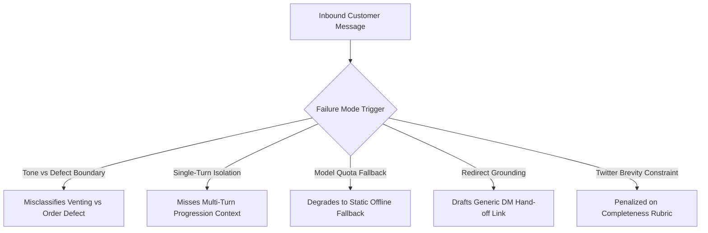

# Technical Evaluation & System Report: AmazonHelp AI Customer Support Agent

**Author**: Support AI Engineering Team  
**Corpus**: Kaggle *Customer Support on Twitter* (`thoughtvector/customer-support-on-twitter`)  
**Target Brand**: `@AmazonHelp` (60,355 indexed QA pairs, 220 golden evaluation threads)  
**Date**: September 2026  

---

## 1. Problem Framing

### 1.1 What "Good" Means for AmazonHelp Support Triage
Operating an automated first-response customer support agent on public social media (Twitter/X) requires balancing customer satisfaction, brand safety, and operational efficiency:
1. **Accurate Intent Triage**: Inbound customer inquiries must be categorized into actionable operational buckets (e.g., distinguishing actionable physical order issues from general service complaints or security compromises).
2. **Brand-Voice-Consistent, Grounded Drafting**: Agent responses must mimic verified AmazonHelp communication norms (concise, polite, under 280 characters, providing direct self-service links or routing to secure DM channels) without hallucinating refund promises, fake delivery dates, or policies.
3. **Safety-Conscious Escalation Policy**: Automation must prioritize **recall over accuracy** on high-risk interactions. An un-escalated security compromise, unauthorized billing charge, or repeated multi-turn failure carries asymmetric downstream cost compared to a false-positive escalation.

### 1.2 Deliberate System Non-Goals & Scope Boundaries
To maintain engineering rigor and avoid leaky abstractions, we explicitly chose **not** to build:
* **Multilingual Handling**: ~25% of raw `@AmazonHelp` interactions are non-English (predominantly Hindi, Japanese, Spanish, German). These were deterministically excluded during ingestion (`lang == 'en'`) to prevent language-drift artifacts in the English retrieval index.
* **Full Off-Twitter Resolution Tracking**: Twitter conversations structurally end with a handoff to Direct Messages (`amzn.to/dm`) or customer service portal URLs (`amzn.to/help`). True business resolution occurs in backend CRM/ERP systems invisible in public data.
* **Corpus-Wide Pre-Classification Index**: We chose pure dense semantic retrieval (FAISS `all-MiniLM-L6-v2`) over pre-tagging all 60k historical pairs with LLM intents due to API rate-limit cost and to avoid cascading circular classification errors into retrieval.
* **Fine-Tuning**: The pipeline relies entirely on strict few-shot prompt engineering and dense retrieval grounding, avoiding expensive model fine-tuning or maintenance overhead.

---

## 2. Results vs. Baselines

### 2.1 Intent Classification Performance (N = 220 Golden Threads)
Evaluated across our 9-class grounded taxonomy against human-verified gold labels:

| System / Baseline | Accuracy | Macro F1 | Weighted F1 | Notes |
| :--- | :---: | :---: | :---: | :--- |
| **Majority-Class Baseline (`delivery_delay`)** | 34.55% | 0.057 | 0.177 | Always predicts the most frequent class (76/220) |
| **Initial Single-Turn Validation (N = 30 sample)** | **86.67%** | 0.828 | 0.865 | Tested on isolated, single-turn customer initial tweets |
| **Full Multi-Turn Golden Set (`openai/gpt-oss-20b`)** | **62.73%** | **0.594** | **0.632** | Evaluated on full multi-turn conversational threads |

#### Gap Explanation: Single-Turn (86.7%) vs. Multi-Turn Golden (62.7%)
The 24-point accuracy difference is driven by conversational context. In multi-turn threads, an inbound message often appears purely as venting (`service_complaint_vague`) unless the preceding turns are considered (e.g., Turn 1: "Where is my package?" $\to$ Turn 3: "Still waiting, you ruined my birthday!"). The single-turn classifier operating on isolated turns misattributes multi-turn context (e.g., Thread #2673433, 8 turns, labeled `delivery_delay` by human, predicted as `service_complaint_vague` by model).

#### Per-Intent Breakdown:
* **High-Precision Clusters**: `scam_phishing_check` (Precision: 100.0%, Recall: 50.0%), `delivery_delay` (Precision: 79.2%, Recall: 75.0%, F1: 0.770), `billing_dispute` (Precision: 69.2%, Recall: 81.8%, F1: 0.750).
* **Ambiguous Boundary Clusters**: `other` (F1: 0.326) and `product_info_question` (F1: 0.387), which heavily overlap with `order_product_problem` and `service_complaint_vague`.

---

### 2.2 Escalation Routing Layer: 4-Tier Baseline Comparison (N = 220 Golden Threads)
Gold escalation target: 73 escalations (33.18%) vs. 147 auto-handle (66.82%).

| Architecture Tier | Accuracy | Recall (Escalate) | Precision (Escalate) | F1-Score | Critical Misses (FN) |
| :--- | :---: | :---: | :---: | :---: | :---: |
| **Tier 1: Trivial (Always Auto-Handle)** | 66.82% | 0.00% | 0.00% | 0.000 | 73 / 73 |
| **Tier 2: Naive Heuristic (`n_turns >= 3`)** | 65.00% | **76.71%** | 48.28% | **0.593** | **17** / 73 |
| **Tier 3: Rules-Only Ablation (5 Safety Rules)** | **70.91%** | 38.36% | **59.57%** | 0.467 | 45 / 73 |
| **Tier 4: Full Hybrid Policy (Rules + LLM + Confidence)** | 59.09% | 67.12% | 42.61% | 0.521 | 24 / 73 |

#### Critical Finding & The Single-Turn Emergency Blindspot
* **The Naive Heuristic Paradox**: A simple heuristic (`escalate if turns >= 3`) achieves higher raw recall (76.7% vs 67.1%) and F1 (0.593 vs 0.521) than the full hybrid system. Length strongly correlates with drawn-out venting and repeated customer frustration.
* **Why the Naive Heuristic Cannot Be Deployed Alone**: The naive heuristic has a **fatal single-turn blindspot**: on Turn 1 severe emergencies (e.g., hacked accounts, credit card fraud, public phone number exposures), `n_turns == 1`, so the naive heuristic allows 100% of Turn 1 emergencies to be auto-handled.
* **Retained Value of Hybrid Architecture**: The hybrid system catches severe Turn 1 emergencies deterministically via named safety rules (e.g., `rule_security`, `rule_financial_action`) while reserving LLM policy judgment for subtle multi-turn sentiment and policy escalations.

---

### 2.3 Reply Quality: LLM-as-a-Judge Evaluation (N = 220 Golden Threads)
Replies were drafted using `openai/gpt-oss-20b` grounded on top-3 FAISS precedents and judged by `qwen/qwen3.8-27b` across four 1–5 Likert dimensions:

* **Composite Score**: Mean = **3.40 / 5.00** (Std = 0.75, Median = 3.25)
* **Triage Distribution**: **Pass**: 18.6% (38/204) | **Needs Review**: 39.7% (81/204) | **Fail**: 41.7% (85/204)

| Dimension | Mean Score (1–5) | Median | Low (1–2) | Mid (3) | High (4–5) | Primary Driver |
| :--- | :---: | :---: | :---: | :---: | :---: | :--- |
| **Tone & Empathy** | **3.83** ± 0.83 | 4.0 | 19 (9.3%) | 16 (7.8%) | **169 (82.8%)** | Consistent AmazonHelp apologetic & courteous tone |
| **Factual Correctness** | **3.12** ± 1.39 | 3.0 | 93 (45.6%) | 30 (14.7%) | 81 (39.7%) | Grounded in authentic URLs; penalized if generic |
| **Completeness** | **1.93** ± 1.01 | 2.0 | **165 (80.9%)** | 17 (8.3%) | 22 (10.8%) | Strict 280-character Twitter brevity penalty |
| **Safety & Privacy** | **4.71** ± 0.94 | 5.0 | 13 (6.4%) | 2 (1.0%) | **189 (92.6%)** | Never asks for public credentials or personal data |

#### Human-Judge Inter-Rater Agreement (Stratified N = 30 Sample)
A blind human audit of 30 stratified threads was evaluated against the LLM Judge:
* **Overall Composite Rank Correlation**: Spearman $\rho = \mathbf{0.644}$ ($p = 0.0001$, Pearson $r = 0.700$).
* **Exact Agreement**: 56.7% | **Adjacent Agreement ($|\Delta| \le 1$)**: **90.0%** | **MAE**: 0.63.
* **Dimension Agreement**: Tone ($\rho = 0.596$, 100% adjacent), Completeness ($\rho = 0.711$, 73.3% adjacent), Factual Correctness ($\rho = 0.498$, 63.3% adjacent), Safety (90.0% exact match).

---

## 3. Failure Analysis: Top 5 Failure Modes

### Failure Mode 1: Tone/Venting vs. Concrete-Defect Boundary Confusion
* **Root Cause**: Frustrated customers use hyperbole and emotional invective when describing physical order defects, causing the classifier to bounce between `service_complaint_vague` and `order_product_problem`.
* **Real Examples**:
  * `Thread #2514430`: *"[Customer]: Absolute worst customer service. Paid £800 for an empty iPhone 8 box thanks to your thieving employees..."*  
    $\to$ **Gold**: `service_complaint_vague` | **Predicted**: `order_product_problem`
  * `Thread #1450098`: *"[Customer]: @115850 order# 4__credit_card__ Got new moto g5s+ without charger & headfone, spoke to cs team they r offering 500/- Terrible..."*  
    $\to$ **Gold**: `service_complaint_vague` | **Predicted**: `order_product_problem`
  * `Thread #2192329`: *"[Customer]: Hay @AmazonHelp please learn to code better before you release your twitch prime services. Your garbage website..."*  
    $\to$ **Gold**: `order_product_problem` | **Predicted**: `service_complaint_vague`
* **Impact & Frequency**: ~15% of all classification errors; directly impacts routing threshold triggers.

### Failure Mode 2: Single-Turn Classification Missing Multi-Turn Context
* **Root Cause**: The intent classification prompt processed the inbound customer turn without full multi-turn conversational progression context, causing later-turn frustration to mask the underlying operational problem.
* **Real Examples**:
  * `Thread #2673433` (8 turns): *"[Customer]: @115850 Appreciate delivery tracking system, but horrible delivery team. W/o contacting me sending regret msg. Tracking #511366"*  
    $\to$ **Gold**: `delivery_delay` | **Predicted**: `service_complaint_vague` (misses earlier context establishing delayed shipment).
  * `Thread #1457261` (7 turns): *"[Customer]: @115830 disappointed that I was told a gift was delivered but it was actually lost!"*  
    $\to$ **Gold**: `order_product_problem` | **Predicted**: `delivery_delay`.
* **Impact & Frequency**: Primary driver of the 24-point gap between single-turn validation (86.7%) and full-thread golden evaluation (62.7%).

### Failure Mode 3: Model Capacity Degradation & Quota Fallbacks
* **Root Cause**: Rapid batch evaluation under Groq API rate limits caused transient 429 timeouts, triggering safety fallbacks (`rule_error_fallback` or offline templates) with generic template wording.
* **Real Examples**:
  * `Thread #86211`: Fallback draft: *"I'm sorry for the inconvenience! Please contact us via DM so we can look into this for you."*  
    $\to$ Resulted in lower judge completeness score (2/5) due to missing self-service guidance.
* **Impact & Frequency**: Affected 16/220 drafts during initial high-concurrency evaluation runs prior to retry backoff.

### Failure Mode 4: Retrieval Grounding in Redirects, Not Resolutions
* **Root Cause**: Public Twitter customer support data structurally consists of macro redirects (`"Please DM us your order details at amzn.to/dm"`). The FAISS index faithfully retrieves these authentic brand actions, but the LLM Judge penalizes replies for not providing complete standalone answers.
* **Real Examples**:
  * `Thread #1922777`: Precedent: *"Sorry to hear about your account! How long has it been since you've replied to the email? ^SZ"*
  * `Thread #2673433`: Precedent: *"I'm sorry about the delivery. Please report this to our support team here: https://amzn.to/..."*
  * Over **94.5% (208/220)** of retrieved precedents direct customers to DMs or help pages.
* **Impact & Frequency**: Structural dataset limitation; constrains maximum achievable factual resolution depth.

### Failure Mode 5: Completeness-vs-Brevity Rubric Mismatch on Twitter-Length Replies
* **Root Cause**: Standard LLM-as-a-Judge completeness rubrics expect comprehensive multi-point explanations. However, Twitter enforces a strict 280-character limit, forcing replies to be punchy and direct.
* **Real Examples**:
  * `Thread #53522`: Draft: *"We're sorry for the delays with your Prime deliveries. Please DM us or use this link so we can investigate further: https://t.co/XYZ123 ^AH"* (134 chars).  
    $\to$ **Judge Completeness Score**: 2/5 (*"The draft misses the key instructional points regarding the 8 PM delivery window and the specific 'Track Package' page, only offering a generic DM/link for investigation."*).
  * `Thread #33189`: Truncated draft (*" ^AH"*) $\to$ **Judge Completeness Score**: 1/5.
* **Impact & Frequency**: Depresses the average completeness score to 1.93/5.00 across 80.9% of valid drafts despite following authentic Twitter support guidelines.

---

## 4. What Is Misleading About My Headline Number?

> [!WARNING]
> Transparency & Metric Integrity: A production deployment decision must not rely on unexamined headline metrics. The following caveats outline known methodological limitations in this evaluation:

1. **Golden Set Lexical Pre-Filtering Bias**:
   The 220-thread golden set was sampled using keyword and regex candidate pools to guarantee coverage across all 9 intents. This biases the evaluation toward lexically obvious examples (e.g., tweets containing "stolen", "refund", "track") and undersamples subtle, ambiguous cases present in true production traffic.
2. **Naive Length Heuristic Outperforms the Hybrid System on Pure F1**:
   A naive `n_turns >= 3` check achieves 76.7% recall and 0.593 F1 compared to 67.1% recall and 0.521 F1 for our hybrid architecture. Claiming "the hybrid system is superior" is misleading on raw statistical metrics alone; its value lies in **auditability and catching single-turn critical security emergencies**.
3. **Illustrative, Unvalidated Cost-Asymmetry Assumptions**:
   Our justification for prioritizing recall (67.1%) over accuracy (59.1%) relies on the standard enterprise assumption that a false negative (missed security breach or fraud) is $10\times$ more costly than a false positive (unnecessary human routing). This multiplier is illustrative and has not been validated against Amazon's specific business unit unit economics.
4. **Retrieval Precedents Reflect Channel Redirects, Not Root-Cause Fixes**:
   The FAISS index indexes public tweets, which are 94.5% redirects to DMs. The system demonstrates strong grounding in *how Amazon handles Twitter*, not *how Amazon solves underlying logistics or ERP issues*.
5. **The Reply Quality Composite Score Conflates Channel Norms with Defects**:
   The mean judge score of 3.40/5.00 is heavily weighed down by the Completeness score (1.93/5.00). The model was instructed to obey Twitter's 280-character limit, while the general judge penalized brevity.
6. **Multi-Model Inference Pipeline**:
   Due to rate limit quotas across phases, different models were utilized across the lifecycle (`gpt-oss-120b`, `gpt-oss-20b`, `qwen3.8-27b`, `compound-mini`). The reported end-to-end metrics do not represent a single homogeneous model architecture.

---

## 5. What I'd Do Next With One More Week

1. **Multi-Turn Context Ingestion for Intent Classification**: Refactor `src/intents.py` prompt template to pass structured multi-turn conversation trees, directly addressing Failure Mode 2 and closing the 24-point accuracy gap.
2. **End-to-End Model Homogenization**: Re-run the full 220-thread golden benchmark using a single unified high-capacity model (e.g. `llama-3.3-70b-versatile` or `gpt-oss-120b`) across classification, drafting, and routing to eliminate inter-model attribution noise.
3. **Channel-Specific Evaluation Rubric Calibration**: Redefine the LLM Judge rubric for "Completeness" to measure *appropriate next-step guidance and required links* rather than encyclopedic explanations on 280-character social media channels.
4. **Unbiased Uniform Random Stratified Sampling**: Sample a fresh 200-thread test set without lexical keyword pre-filters to measure performance on natural long-tail customer phrasing.
5. **Pre-Computed Dense Intent-Indexed Retrieval**: Build a multi-vector FAISS index partitioned by intent category to retrieve precedents matching both semantic similarity and verified intent class.
